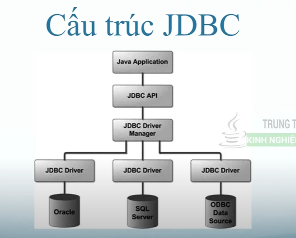

# 01 JDBC trong Java
- JDBC là công cụ hỗ trợ kết nối chương trình Java với CSDL
- JDBC: Java Database Connectivity
- Thư viện hỗ trợ kết nối với CSDL (Database)
  - Tạo kết nối
  - Tạo câu lệnh SQL
  - Thực thi câu lệnh SQL
  - Xem và sửa kết quả trên Database

- Thư viện JDBC
  - DriverManager: quản lí drivers
  - Driver: Kết nối với database driver
  - Connection: Quản lí kết nối
  - Statement: Quản lí các câu lệnh
  - ResultSet: Tập kết quả trả về
  - SQLException: Lỗi ngoại lệ
# 02 Kết nối JDBC với MySql Server
# 03 JDBC Statements và ResultSet
- Dữ liệu mapping giữa java và sql
  - VARCHAR, CHAR, LONGVARCHAR -> java.lang.String
  - BIT -> boolean
  - TINYINT, SMALLINT, INTEGER -> int
  - BIGINT -> long
  - FLOAT -> float
  - DOUBLE -> double
  - DATE -> java.sql.Date
  - TIME -> java.sql.Time
  - TIMESTAMP -> java.sql.Timestamp
  - BLOB -> java.sql.Blob
# 03 SELECT WHERE Statement JDBC
# 04 CREATE, DROP Table Statement JDBC
# 05 INSERT, UPDATE, DELETE Statement JDBC
# 06 PrepareStatement JDBC
- Sử dụng giống với statement bình thường, nhưng phải truyền sql khi tạo prepareStatement
# 07 SELECT, UPDATE, DELETE PrepareStatement JDBC
# 08 JDBC Transaction
- Đảm bảo các giao dịch thành công và đảm bảo tính toàn vẹn của dữ liệu
# 09 Batch Processing JDBC
- Thực thi nhiều câu lệnh cùng 1 lúc
# 10 CallableStatement JDBC
- Gọi Store Procedure hoặc hàm trong sql
# 11 ResultSetMetaData JDBC
- Lấy tổng số cột trả về, tên cột, tên bảng, kiểu dữ liệu của cột trong database 
# 12 DatabaseMetaData JDBC
- Lấy thông tin của database: tên của database, phiên bản, user name, password
# 13 Lưu File vào trong Database JDBC
# 14 Đọc file từ Database JDBC
# 15 Rowset Interface JDBC
- Dùng truy xuất dữ liệu như statement